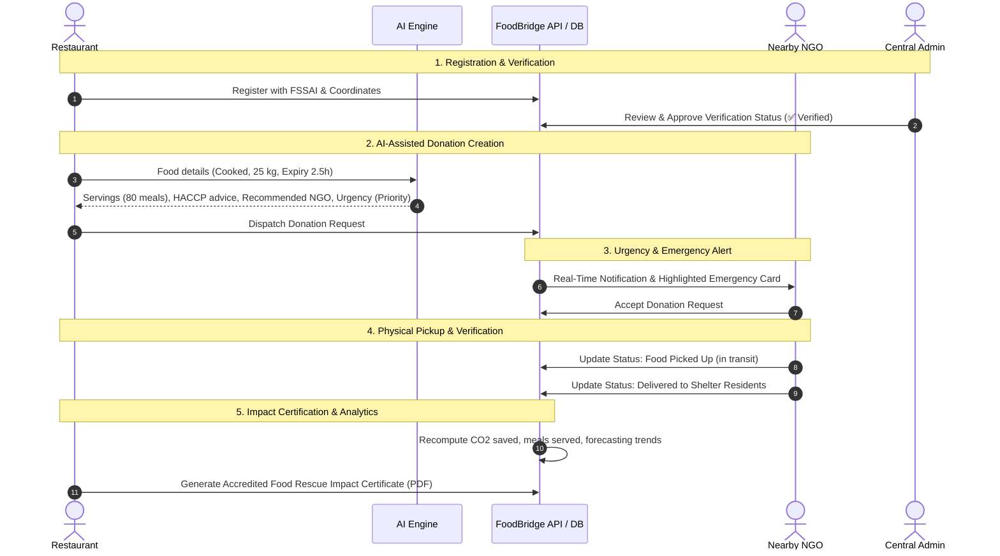
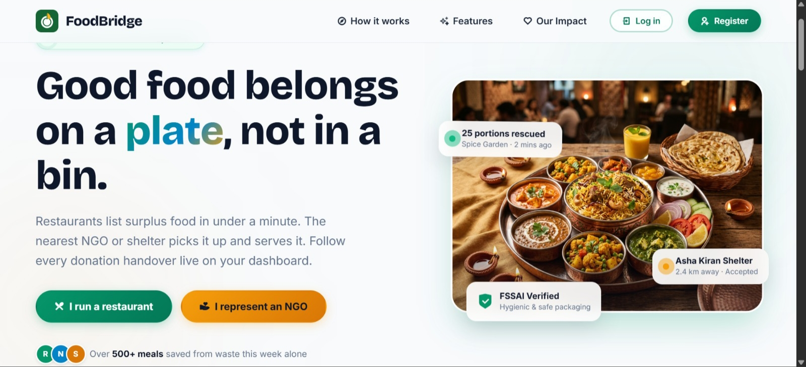
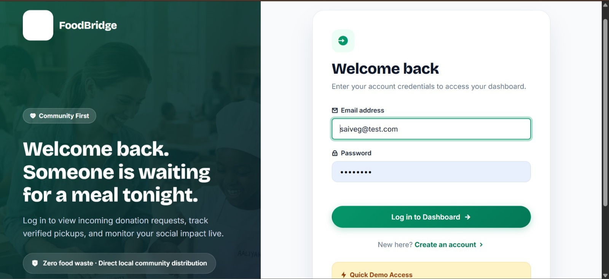
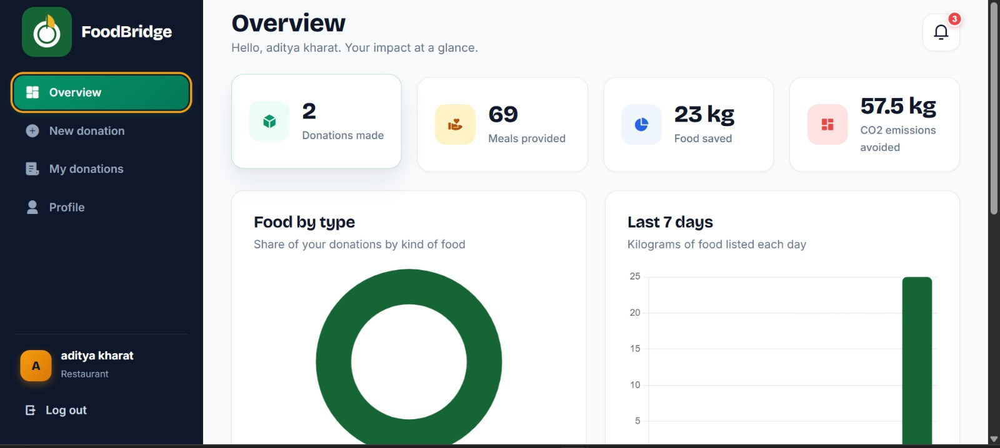
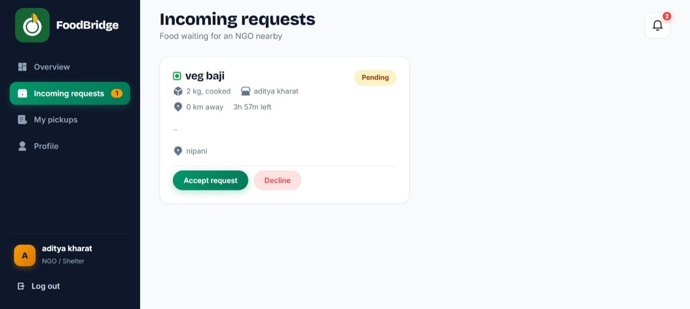
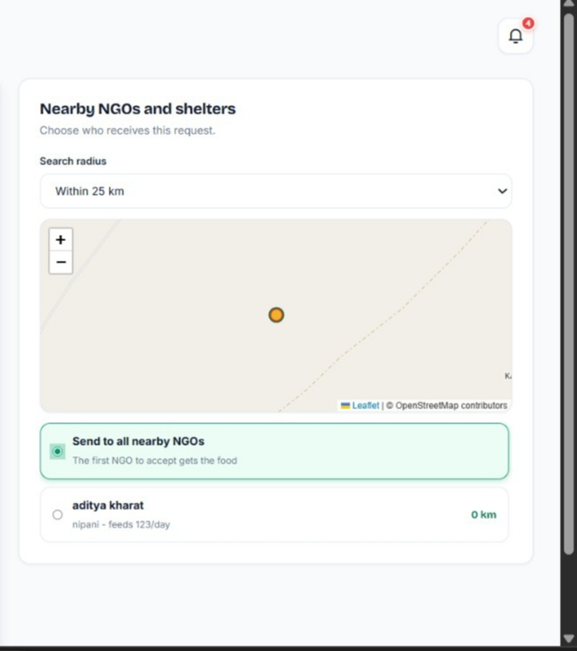

<div align="center">

# 🍽️ FoodBridge
### Food Waste Reduction & Real-Time Donation Management System


**Final Year Engineering Capstone Project | Problem 14: Food Waste Reduction Platform**

</div>

---

## 📑 Table of Contents

1. [Project Overview](#-project-overview)
2. [Problem Statement & Solution](#-problem-statement--solution)
3. [Key Features](#-key-features)
4. [5 Major Upgraded Features](#-5-major-upgraded-features)
   - [1. 🤖 AI Food Donation Assistant](#1--ai-food-donation-assistant)
   - [2. ⏰ Food Expiry & Emergency Rescue System](#2--food-expiry--emergency-rescue-system)
   - [3. 📊 Food Waste Forecasting & Analytics](#3--food-waste-forecasting--analytics)
   - [4. 🛡️ Restaurant & NGO Trust / Verification System](#4--restaurant--ngo-trust--verification-system)
   - [5. 🌍 Food Rescue Impact Certificate & Digital Profile](#5--food-rescue-impact-certificate--digital-profile)
5. [User Roles & Permissions](#-user-roles--permissions)
6. [System Workflow](#-system-workflow)
7. [Technology Stack](#-technology-stack)
8. [Database Design](#-database-design)
9. [API Documentation](#-api-documentation)
10. [Security & Compliance](#-security--compliance)
11. [Screenshots](#-screenshots)
12. [Installation & Local Setup](#-installation--local-setup)
13. [Environment Variables](#-environment-variables)
14. [Deployment (Vercel & GitHub)](#-deployment-vercel--github)
15. [Demo Accounts](#-demo-accounts)
16. [Future Scope](#-future-scope)
17. [Project Impact](#-project-impact)
18. [Author & Acknowledgements](#-author--acknowledgements)

---

## 📖 Project Overview

**FoodBridge** is an enterprise-grade full-stack web platform designed to solve the critical urban challenge of edible food waste. Every day, commercial kitchens, banquet halls, restaurants, and catering services discard large volumes of safe, untouched food due to lack of immediate logistical coordination. Concurrently, thousands of vulnerable individuals in nearby community shelters and NGOs face nutritional insecurity.

FoodBridge bridges this logistical divide by enabling restaurants to list surplus food within seconds, applying intelligent AI recommendations, matching nearby shelters based on spatial distance and capacity, automating emergency rescue workflows for time-critical items, and verifying every handover with digital chain-of-custody tracking.

---

## ❗ Problem Statement & Solution

### The Challenge
- **Rapid Spoilage & Time Decay:** Cooked food has a strict safe-consumption window (2–6 hours). Traditional phone calls and manual coordination take too long.
- **Information Asymmetry:** Food donors do not know which nearby NGO has the physical capacity or logistical readiness to collect surplus food right now.
- **Accountability & Trust:** Lack of verified FSSAI licenses, NGO registration records, and tamper-evident audit trails prevents large hospitality chains from donating.

### The FoodBridge Solution
- **Real-Time Geospatial Matching:** Haversine spatial ranking pairs restaurants with the nearest eligible shelters on an interactive map.
- **AI Donation Assistant:** Automatically evaluates food urgency, calculates meal portions, and matches the optimal shelter with certified HACCP hygiene guidelines.
- **Tiered Urgency Rescues:** Flags emergency donations expiring in under 2 hours with visual pulses, prioritizing them to the top of NGO dispatch feeds.
- **Forecasting & Trust Verification:** Empowers restaurants with predictive waste analytics and verified digital impact certificates.

---

## ✨ Key Features

### 🏢 Core Foundation
- **Role-Based Portals:** Dedicated, customized interfaces for Restaurants, NGOs, and Central Administrators.
- **Interactive OpenStreetMap / Leaflet Integration:** Visual map pins showing exact distances and route proximity in real-time.
- **Detailed Food Specifications:** Food categorization (Cooked, Raw, Packaged, Bakery), dietary flags (Veg/Non-Veg), quantities, units, and strict expiry timestamps.
- **Direct & Broadcast Requests:** Ability to target a specific shelter or broadcast an open request to all verified NGOs within a customizable radius (10–100 km).
- **Four-Stage Live Lifecycle Tracking:** Real-time visual timeline (`Pending` $\rightarrow$ `Accepted` $\rightarrow$ `PickedUp` $\rightarrow$ `Completed`) with automated timestamp auditing.
- **Instant Audio-Visual Notifications:** Notification drawer with automated alerts for request dispatches, acceptances, vehicle dispatches, and completions.
- **Account Recovery & Password Reset:** Cryptographic SHA-256 single-use token recovery workflow with 1-hour expiration safeguarding donor and NGO account access.

---

## 🌟 5 Major Upgraded Features

### 1. 🤖 AI Food Donation Assistant
- **Endpoint:** `POST /api/ai/assist`
- **Portion & Servings Estimator:** Automatically converts bulk raw ingredients, bulk cooked food (kg/liters), or portions into precise nutritious meal counts (e.g. 35 kg cooked meal $\rightarrow$ 116 meals supported).
- **Automated Urgency Assessment:** Analyzes remaining shelf life and preparation time to compute urgency and dispatch windows (`Priority 1 Emergency`, `Priority 2 High`, `Priority 3 Standard`).
- **Capacity & Distance Scoring:** Evaluates real NGOs in the database, balancing driving distance, shelter feeding capacity, and accreditation to recommend the optimal receiving partner with a one-click apply button.
- **HACCP Food Safety Guidelines:** Produces tailored food handling rules based on category (hot holding >60°C, rapid chilling <4°C within 90 minutes, ambient storage parameters, and tamper-evident packaging checklists).
- **Hybrid AI Architecture:** Operates with a deterministic expert heuristic engine that works 100% offline or with cloud LLMs (Gemini API) without leaking secrets to the browser.

### 2. ⏰ Food Expiry & Emergency Rescue System
- **Tiered Urgency Classification:**
  - 🟢 **Normal:** Food safe for > 6 hours.
  - 🟡 **Priority:** Food safe for 2 to 6 hours.
  - 🔴 **Emergency:** Food expiring in less than 2 hours.
- **Live Countdown Timers:** Dynamic, second-by-second countdowns on cards (`1h 24m left`) with pulsing danger badges for urgent items.
- **Emergency Alert Banner:** Site-wide banner in the dashboard automatically highlights active emergency donations expiring nearby.
- **Prioritized NGO Feeds:** Emergency donations are automatically hoisted to the top of the incoming request queue to ensure immediate pickup dispatch.
- **Automated Expiry Demonization:** Background engine transitions stale unclaimed requests to `Expired` once the consumption threshold passes.

### 3. 📊 Food Waste Forecasting & Analytics
- **Endpoint:** `GET /api/stats/forecast`
- **Historical Waste Audit:** Tracks historical kitchen surplus by volume (kg), meals provided, and carbon footprint avoided.
- **Food Category Breakdown:** Visual Doughnut chart illustrating surplus generation across Cooked, Raw, Packaged, and Bakery items.
- **Day-of-Week Pattern Recognition:** Bar chart illustrating weekly surplus spikes (e.g. Saturday weekend banquet excess vs weekday patterns).
- **Predictive Surplus Engine:** Uses real historical donation records to calculate weighted moving averages and projects next-cycle surplus quantities (kg) with confidence scores and recommended listing time windows.
- **Graceful Data Adequacy Indicator:** Clearly alerts users when fewer than 3 donations are logged, maintaining data integrity without fabricating synthetic figures.

### 4. 🛡️ Restaurant & NGO Trust / Verification System
- **Endpoints:** `GET /api/admin/verifications`, `PUT /api/admin/verify/:userId`, `PUT /api/auth/verification-details`
- **Three-Tier Verification States:**
  - ✅ **Verified Partner:** Accredited organization with checked FSSAI or NGO registration credentials.
  - ⏳ **Verification Pending:** Newly registered organization awaiting compliance review.
  - ❌ **Needs Review:** Rejected or incomplete documentation requiring re-submission.
- **Trust Badges & Dynamic Scoring:** Dynamic trust rating (1.0 to 5.0 stars) calculated from successful rescue completion history.
- **Admin Verification Portal:** Dedicated administrator view to inspect organization contact details, FSSAI licenses, NGO registration numbers, and approve or reject submissions in real time with reason tracking.

### 5. 🌍 Food Rescue Impact Certificate & Digital Profile
- **Endpoint:** `GET /api/stats/certificate`
- **Official Digital Certificate:** High-resolution impact accreditation complete with official Certificate Serial Number (`FB-CERT-2026-XXXXXX`), issue date, organization title, and verified seal.
- **Verified Environmental & Humanitarian Metrics:**
  - Total Kilograms of Food Diverted from Landfills
  - Number of Nutritious Meals Distributed to the Community
  - Kilograms of CO₂ Equivalent Greenhouse Gases Averted ($2.5\text{ kg CO}_2\text{e per kg food}$)
- **Print & PDF Export:** Integrated `@media print` layout formatting the certificate into a standard A4 award ready for framing or sustainability reporting.
- **Monthly Ledger:** Chronological monthly breakdown table logging verified impact over time.

---

## 👥 User Roles & Permissions

| Role | Access & Capabilities |
|------|------------------------|
| **🍴 Restaurant** | List surplus food, run AI Donation Assistant, view nearby NGOs, track dispatch timeline, access Waste Forecasting, download Impact Certificate, update FSSAI license details. |
| **🤝 NGO / Shelter** | View incoming requests sorted by emergency urgency, accept/decline donations, update statuses (`PickedUp`, `Completed`), view donor contact details, download Impact Certificate, update NGO registration documents. |
| **🛡️ Administrator** | Access Admin Verification Portal, review pending restaurant and NGO license submissions, approve/reject accreditations, inspect platform-wide forecasting analytics. |

---

## 🔄 System Workflow



---

## 💻 Technology Stack

- **Runtime Environment:** Node.js (v18+ / v22 LTS)
- **Web Application Framework:** Express.js 4.19
- **Database & ODM:** MongoDB Atlas with Mongoose 8.5
- **Authentication & Security:** JSON Web Tokens (JWT), Bcrypt.js password hashing, Role-Based Access Control (RBAC), CORS middleware
- **Geospatial & Mapping:** Leaflet.js 1.9, OpenStreetMap tiles, Haversine spherical distance formula
- **Data Visualizations:** Chart.js 4.4 (Bar, Doughnut, Line charts)
- **Icons & Typography:** Remix Icon 4.2, Google Fonts (*Bricolage Grotesque* & *Inter*)
- **Hosting & Serverless Architecture:** Vercel Serverless Functions (`@vercel/node`)

---

## 🗄️ Database Design

### Collections
1. **`users`:** Stores authentication credentials, organization roles (`restaurant`, `ngo`, `admin`), GPS coordinates (`lat`, `long`), FSSAI license / NGO registration numbers, capacity, `verificationStatus` (`verified`, `pending`, `rejected`), `verificationDate`, `verifiedBy`, and `trustScore`.
2. **`donations`:** Records surplus food listings, food type, veg flag, quantity, unit, preparation time, expiry time, `urgency` (`Normal`, `Priority`, `Emergency`), `aiRecommendation` object, status (`Pending`, `Accepted`, `PickedUp`, `Completed`, `Rejected`, `Cancelled`, `Expired`), status history timeline, and restaurant/NGO references.
3. **`notifications`:** Tracks event-driven alerts, recipient user reference, message body, read status, and creation timestamps.

---

## 🔌 API Documentation

### Authentication & Profiles
- `POST /api/auth/register` — Register a new restaurant or NGO account
- `POST /api/auth/login` — Authenticate and receive JWT Bearer token
- `POST /api/auth/forgot-password` — Generate secure cryptographic password reset token (1h expiry)
- `POST /api/auth/reset-password` — Verify reset token and update account password with Bcrypt hashing
- `GET /api/auth/me` — Retrieve authenticated user profile with verification status
- `PUT /api/auth/verification-details` — Update license registration numbers and compliance notes

### AI & Urgent Donations
- `POST /api/ai/assist` — Run AI Donation Assistant for servings, urgency, safety, and shelter matching
- `GET /api/donations/emergency` — Fetch all pending donations expiring within 2 hours
- `POST /api/donations` — Create a new food donation listing with AI metadata
- `GET /api/donations/mine` — Retrieve restaurant's listings or NGO's claimed pickups
- `GET /api/donations/incoming` — Retrieve incoming donation requests prioritized by urgency
- `POST /api/donations/:id/accept` — Accept a donation request (NGO only)
- `POST /api/donations/:id/reject` — Decline a donation request
- `PUT /api/donations/:id/status` — Advance lifecycle status (`PickedUp`, `Completed`, `Cancelled`)

### Analytics, Certificates & Admin
- `GET /api/stats/impact` — Overview numbers (food saved, meals provided, CO2 avoided)
- `GET /api/stats/forecast` — Kitchen waste trends, day-of-week patterns, ML surplus projections
- `GET /api/stats/certificate` — Official accredited impact certificate metadata
- `GET /api/admin/overview` — Platform-wide statistics (Admin only)
- `GET /api/admin/verifications` — List all organizations and compliance details (Admin only)
- `PUT /api/admin/verify/:userId` — Approve or reject organization accreditation (Admin only)

---

## 🔒 Security & Compliance

- **JWT Stateless Authentication:** Tokens signed with strong HMAC secrets and set to expire after 7 days.
- **Bcrypt Password Salt Hashing:** Passwords hashed with 10 salt rounds prior to persistence.
- **Zero Client-Side Secret Exposure:** All database URIs and optional AI keys remain strictly server-side.
- **Serverless DNS & Connection Pooling:** Guards against DNS hijacking in serverless environments and utilizes connection caching to prevent connection exhaustion.
- **CORS & Input Sanitization:** Sanitizes inputs and guards endpoints against cross-origin abuse.

---

## 📸 Screenshots

| View | Description | Preview |
|------|-------------|---------|
| **Home Page** | Landing page with live impact statistics |  |
| **Login Page** | Secure authentication with Quick Demo logins |  |
| **Restaurant Dashboard** | Real-time overview of meals served and CO2 saved |  |
| **NGO Incoming Requests** | Incoming donation feed with real-time urgency cues |  |
| **Nearby NGOs Map** | OpenStreetMap with Haversine distance ranking |  |
| **AI Assistant & New Listing** *(New)* | AI donation assistant estimating servings, urgency & shelter matching | *`[Screenshot Placeholder: AI Food Donation Assistant Modal]`* |
| **Emergency Rescue Feed** *(New)* | Live countdown badges (🔴 Emergency <2h, 🟡 Priority) and alerts | *`[Screenshot Placeholder: Emergency Urgency Badges & Rescue Banner]`* |
| **Waste Forecasting** *(New)* | Dynamic Chart.js charts showing surplus patterns and ML forecasts | *`[Screenshot Placeholder: Food Waste Forecasting Analytics Dashboard]`* |
| **Impact Certificate** *(New)* | Official printable certificate with serial number and verified seal | *`[Screenshot Placeholder: Food Rescue Impact Certificate]`* |
| **Admin Verification** *(New)* | Admin portal for reviewing and approving FSSAI & NGO licenses | *`[Screenshot Placeholder: Admin Trust & Verification Portal]`* |

---

## ⚙️ Installation & Local Setup

### Prerequisites
- Node.js 18.x or 20+ installed
- MongoDB Atlas cluster URI

### Step-by-Step Setup
1. **Clone the repository:**
   ```bash
   git clone https://github.com/YOUR_USERNAME/FOOD-BRIDGE.git
   cd FOOD-BRIDGE
   ```
2. **Install project dependencies:**
   ```bash
   npm install
   ```
3. **Configure environment variables:**
   Create a `.env` file in the project root:
   ```env
   MONGODB_URI=your_mongodb_atlas_connection_string
   JWT_SECRET=your_jwt_secret_key
   PORT=5000
   ```
4. **Seed demo data (Optional but recommended):**
   ```bash
   npm run seed
   ```
5. **Start the application:**
   ```bash
   npm start
   ```
6. Open your browser and navigate to:
   ```
   http://localhost:5000
   ```

---

## 🔑 Environment Variables

| Variable Name | Required | Description |
|---------------|----------|-------------|
| `MONGODB_URI` | **Yes** | MongoDB Atlas connection string (e.g. `mongodb+srv://...`) |
| `JWT_SECRET` | **Yes** | Cryptographic secret used for signing JSON Web Tokens |
| `PORT` | Optional | Port on which the local server runs (defaults to `5000`) |
| `GEMINI_API_KEY` | Optional | Google Gemini API key for external LLM advice generation |

---

## 🚀 Deployment (Vercel & GitHub)

### Deploy to Vercel
1. Push your latest code to your GitHub repository:
   ```bash
   git add .
   git commit -m "Upgrade FoodBridge with 5 major features"
   git push origin main
   ```
2. Go to your [Vercel Dashboard](https://vercel.com/dashboard) and import your repository.
3. In **Project Settings $\rightarrow$ Environment Variables**, configure:
   - `MONGODB_URI`
   - `JWT_SECRET`
4. In **MongoDB Atlas $\rightarrow$ Network Access**, ensure `0.0.0.0/0` (Allow Access from Anywhere) is enabled so Vercel serverless functions can connect.
5. Deploy! Vercel will build and serve both the Express API and frontend static assets under a unified domain.

---

## 🧪 Demo Accounts

Run `npm run seed` to load these pre-configured demo credentials:

| Role | Email | Password | Status |
|------|-------|----------|--------|
| **🍴 Restaurant** | `restaurant@demo.com` | `demo123` | ✅ Verified Partner |
| **🍴 Pending Restaurant** | `annapurna@demo.com` | `demo123` | ⏳ Pending Review |
| **🤝 NGO / Shelter** | `ngo@demo.com` | `demo123` | ✅ Verified Partner |
| **🤝 Pending NGO** | `seva@demo.com` | `demo123` | ⏳ Pending Review |
| **🛡️ Administrator** | `admin@demo.com` | `demo123` | Master Admin Portal |

---

## 🔮 Future Scope

- **IoT Smart Weight Sensors:** Automated donation listing directly from commercial weighing scale integrations.
- **SMS / WhatsApp Webhook Alerts:** Direct WhatsApp dispatch messages to shelter drivers for emergency items.
- **Multilingual Localization:** Supporting regional Indian languages (Hindi, Kannada, Marathi, Tamil) for volunteer drivers.
- **Route Optimization:** Multi-stop pickup routing for NGO collection vans navigating multiple restaurant stops.

---

## 🌍 Project Impact

Food waste accounts for approximately 8–10% of global greenhouse gas emissions. In India alone, millions of tons of prepared meals are lost annually while hunger remains pervasive. 

By removing communication friction, providing AI-assisted safety guidance, automating emergency rescues, and establishing verifiable accountability through impact certificates, **FoodBridge transforms potential food waste into immediate community nourishment.**

---

## 👨‍💻 Author & Acknowledgements

**Aditya Kharat**  
Final Year Engineering Student  

### Acknowledgements
- OpenStreetMap and Leaflet for mapping APIs
- Chart.js for data visualization libraries
- MongoDB Atlas for resilient cloud database hosting
- Faculty advisors for project problem statement guidance and evaluation

<div align="center">

**Good food belongs on a plate, not in a bin.** 🌱

</div>
